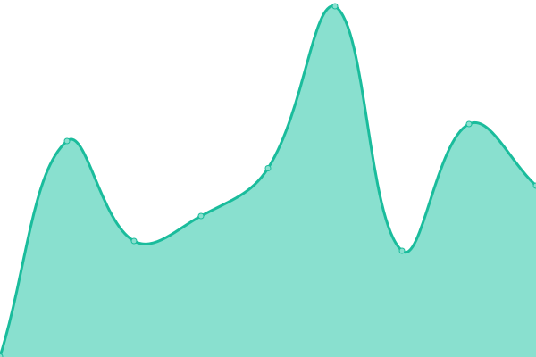
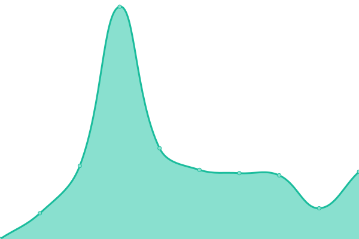

# [📈 Live Status](https://fermunozfbb.github.io/upptime): <!--live status--> **🟧 Partial outage**

This repository contains the open-source uptime monitor and status page for [Fernando](https://fermunozfbb.github.io/upptime), powered by [Upptime](https://github.com/upptime/upptime).

With [Upptime](https://upptime.js.org), you can get your own unlimited and free uptime monitor and status page, powered entirely by a GitHub repository. We use [Issues](https://github.com/fermunozfbb/upptime/issues) as incident reports, [Actions](https://github.com/fermunozfbb/upptime/actions) as uptime monitors, and [Pages](https://fermunozfbb.github.io/upptime) for the status page.

<!--start: status pages-->
<!-- This summary is generated by Upptime (https://github.com/upptime/upptime) -->
<!-- Do not edit this manually, your changes will be overwritten -->
<!-- prettier-ignore -->
| URL | Status | History | Response Time | Uptime |
| --- | ------ | ------- | ------------- | ------ |
|  [Openbank produccion](https://www.openbank.es/) | 🟩 Up | [openbank-produccion.yml](https://github.com/fermunozfbb/upptime/commits/HEAD/history/openbank-produccion.yml) | 

 443ms
     
 | 

<a href="https://fermunozfbb.github.io/upptime/history/openbank-produccion">98.49%</a>
    

|  [Openbank ocu](https://www.ocu.openbank.es/) | 🟥 Down | [openbank-ocu.yml](https://github.com/fermunozfbb/upptime/commits/HEAD/history/openbank-ocu.yml) | 

 0ms
     
 | 

<a href="https://fermunozfbb.github.io/upptime/history/openbank-ocu">0.00%</a>
    

|  [Desmotivadores](https://despair.com/) | 🟩 Up | [desmotivadores.yml](https://github.com/fermunozfbb/upptime/commits/HEAD/history/desmotivadores.yml) | 

 166ms
     
 | 

<a href="https://fermunozfbb.github.io/upptime/history/desmotivadores">100.00%</a>
    

|  [Prosegur](https://www.prosegur.es/) | 🟩 Up | [prosegur.yml](https://github.com/fermunozfbb/upptime/commits/HEAD/history/prosegur.yml) | 

 759ms
     
 | 

<a href="https://fermunozfbb.github.io/upptime/history/prosegur">100.00%</a>
    

|  [Quiron](https://www.quironsalud.es/) | 🟩 Up | [quiron.yml](https://github.com/fermunozfbb/upptime/commits/HEAD/history/quiron.yml) | 

 3138ms
     
 | 

<a href="https://fermunozfbb.github.io/upptime/history/quiron">100.00%</a>
    

<!--end: status pages-->

[**Visit our status website →**](https://fermunozfbb.github.io/upptime)

## 📄 License

- Powered by: [Upptime](https://github.com/upptime/upptime)
- Code: [MIT](./LICENSE) © [Fernando](https://fermunozfbb.github.io/upptime)
- Data in the `./history` directory: [Open Database License](https://opendatacommons.org/licenses/odbl/1-0/)
